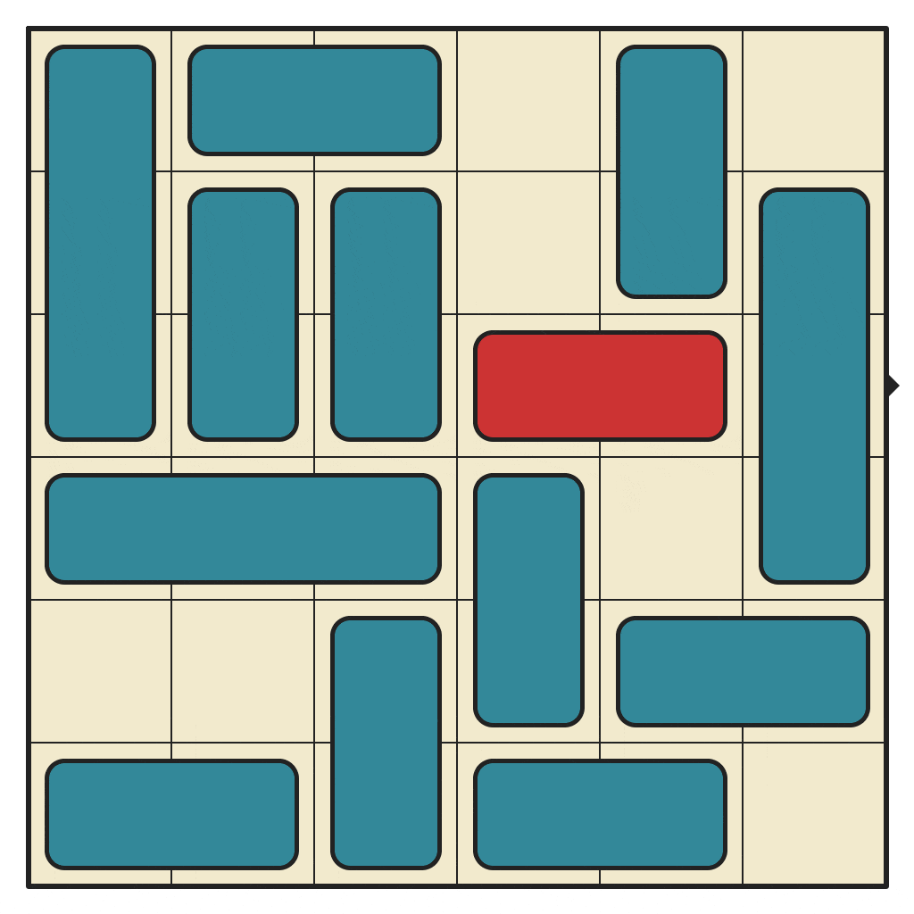
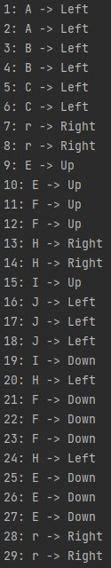

# 🚗 Rush Hour Solver in PHP
Rush Hour is a tiny sliding board game played on a board of 6x6 squares(it can be larger). The objective in the game is to free the red car from the surrounding traffic by sliding the cars out of the way onto free squares until the red car can drive out of the exit on the right side of the board. Note that cars can only go forward of reverse, not to the side. Use google or this video for an impression.

<p align="center"></p>

**Contents**
- [Requirements](#requirements)
- [Installation](#installation)
- [Quickstart](#quickstart)
    - [Loading a Board](#loading-a-board)
    - [Solving board](#solving-board)
- [Contributing and Reporting Bugs](#contributing-and-reporting-bugs)
- [Credits](#credits)
- [License](#license)

## Requirements
This version of the package is only compatible with **[PHP 8.1](https://www.php.net/releases/)** or higher.


## Installation
Install the package via **[composer](https://getcomposer.org/)**:
``` bash
composer require aminyazdanpanah/rush-hour-solver
```
Alternatively, add the dependency directly to your `composer.json` file:
``` json
"require": {
    "aminyazdanpanah/rush-hour-solver": "^0.1"
}
```

## Quickstart
First of all, you need to include the package in your code:
```php
require 'vendor/autoload.php'; // path to the autoload file
```

### Loading a Board
There two ways to load a board.

#### 1. From an  array
```php
use RushHourSolver\BoardLoader;

$board_array = [
    [".", ".", ".", ".", "A", "A"],
    [".", ".", "B", "B", "C", "C"],
    ["r", "r", ".", ".", "E", "F"],
    ["G", "G", "H", "H", "E", "F"],
    [".", ".", ".", "I", "E", "F"],
    [".", ".", ".", "I", "J", "J"],
];

$board_loader = new BoardLoader($board_array);
$board = $board_loader->getBoard();
```

#### 2. From a file
```php
use RushHourSolver\BoardLoader;

$board_loader = new BoardLoader();
$board_loader->loadBoardFromFile("/path/to/board.txt");
$board = $board_loader->getBoard();
```

### Solving board
```php
use RushHourSolver\BoardSolver;
use RushHourSolver\Enums\Direction;
use RushHourSolver\Enums\Orientation;

$board_solver = new BoardSolver($board);
$solutions = $board_solver->getSolution();

foreach ($solutions as $index => $solution) {
    $vehicle = $solution[0];
    $direction = $solution[1];

    if ($vehicle->getOrientation() === Orientation::HORIZONTAL && $direction === Direction::FORWARD) {
        $direction_name = "Right";
    } elseif ($vehicle->getOrientation() === Orientation::HORIZONTAL && $direction === Direction::BACKWARD) {
        $direction_name = "Left";
    } elseif ($vehicle->getOrientation() === Orientation::VERTICAL && $direction === Direction::FORWARD) {
        $direction_name = "Down";
    } elseif ($vehicle->getOrientation() === Orientation::VERTICAL && $direction === Direction::BACKWARD) {
        $direction_name = "Up";
    } else {
        $direction_name = "Unknown";
    }

    echo "\n" . $index + 1 . ": " . $vehicle->getName() . " -> " . $direction_name;
}
```

### output
steps to solve the board
<p align="center"></p>


## Contributing and Reporting Bugs
I'd love your help in improving, correcting, adding to the specification. Please **[file an issue](https://github.com/aminyazdanpanah/rush-hour-solver/issues)** or **[submit a pull request](https://github.com/aminyazdanpanah/rush-hour-solver/pulls)**.
- See **[Contributing File](https://github.com/aminyazdanpanah/rush-hour-solver/blob/master/CONTRIBUTING.md)** for more information.
- If you discover a security vulnerability within this package, please see **[SECURITY File](https://github.com/aminyazdanpanah/rush-hour-solver/blob/master/SECURITY.md)** for more information.

## Credits
- **[Amin Yazdanpanah](https://www.aminyazdanpanah.com/?u=github.com/aminyazdanpanah/rush-hour-solver)**

## License
The MIT License (MIT). See **[License File](https://github.com/aminyazdanpanah/rush-hour-solver/blob/master/LICENSE)** for more information.